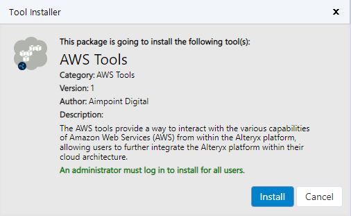
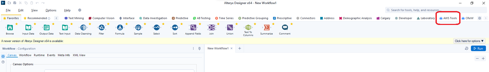
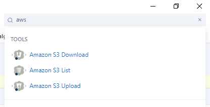

# AWS Tools User Guide

## Installation Instructions

1. Download the AWS tools.yxi file from the Alteryx Marketplace, here.

2.  Run the AWS Tools.yxi file to launch the installation. You will
    require admin rights on the machine to complete the installation.

3.  Click ‘Install’ on the installer as per image below:

4.  The tools have now been installed and are added to the palette as a
    new tab, typically on the far right of existing tabs as in the image
    below.

> You can also find the tools using the search bar:

